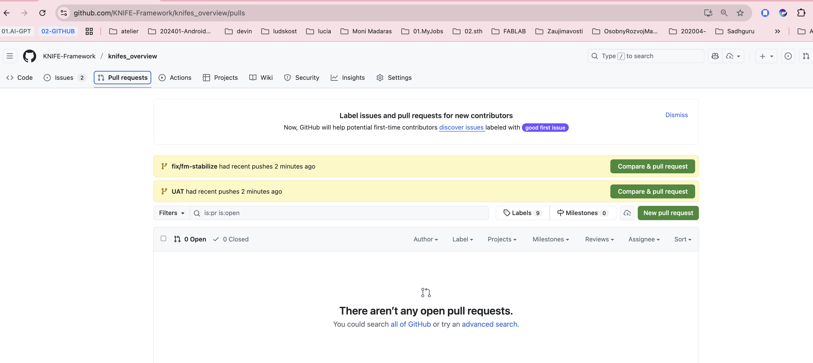
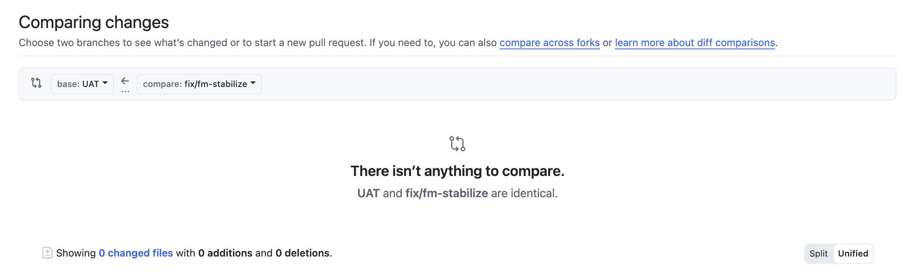

---
id: "K-TASK-GIT-PR-TO-UAT"
dao: "knife"
title: "Ako vytvoriť Pull Request z fix vetvy do UAT"
description: "Praktický návod na vytvorenie a kontrolu PR z pracovnej vetvy fix/fm-stabilize do testovacej vetvy UAT pred publikovaním do produkcie."
author: "Roman Kazička"
category: "git"
type: "howto"
priority: "Hi"
tags: ["GIT", "UAT", "PullRequest", "Workflow"]
created: "2025-10-06"
modified: "-"
status: "inprogress"
locale: "sk"
sidebar_label: "K-TASK: PR to UAT"
rights_holder_content: "Roman Kazička"
rights_holder_system: "Roman Kazička (CAA/KNIFE/LetItGrow)"
license: "CC-BY-NC-SA-4.0"
disclaimer: "Use at your own risk. Educational and internal reference only."
copyright: "© 2025 Roman Kazička / SystemThinking"
author_id: "-"
author_did: "-"
---

# 🧩 K-TASK: Ako vytvoriť Pull Request z fix vetvy do UAT

Tento návod opisuje bezpečný postup, ako preniesť zmeny z pracovnej vetvy **fix/fm-stabilize** do testovacej vetvy **UAT**.  
Cieľom je mať kontrolovaný prechod pred nasadením do produkcie (PROD).

---

## 1️⃣ Predpoklady

- všetky zmeny sú commitnuté:  
  ```
  git status
  ```
  → má zobraziť *nothing to commit, working tree clean*  
- aktuálna vetva:  
  ```
  git branch
  ```
  → `* fix/fm-stabilize`
- repo je zosynchronizované:  
  ```
  git pull
  ```

---

## 2️⃣ Vytvorenie vetvy UAT (ak ešte neexistuje)

```
git checkout -b UAT
git push -u origin UAT
```

> `-u` nastaví **upstream** (väzbu medzi lokálnou vetvou UAT a jej vzdialenou kópiou).

Ak už existuje, len sa na ňu prepnite:
```
git switch UAT
git pull
```

---

## 3️⃣ Návrat do pracovnej vetvy (fix)

```
git switch fix/fm-stabilize
```

---

## 4️⃣ Otvorenie Pull Requestu (GUI)

1. Prejdi na GitHub repozitár projektu.  
2. V menu **Pull requests → New pull request**.  
3. Vyber:
   - **base:** `UAT`
   - **compare:** `fix/fm-stabilize`
   - 
Poďme si to vysvetliť presne podľa  screenshotu 👇

🟡 1️⃣ fix/fm-stabilize had recent pushes

➡️ toto znamená, že tvoja pracovná vetva (fix/fm-stabilize) má nové commity, ktoré ešte neboli zlúčené.
➡️ Tlačidlo “Compare & pull request” pri tomto riadku ťa zoberie na obrazovku, kde vytvoríš PR z fix/fm-stabilize → do main (predvolený base branch).

⚠️ Toto nechceme — ty teraz chceš poslať PR do UAT, nie do main.

🟡 2️⃣ UAT had recent pushes

➡️ Toto len oznamuje, že vetva UAT tiež dostala nový commit (napr. si ju práve vytvoril alebo pushol).
➡️ Tlačidlo „Compare & pull request“ tu by otvorilo porovnanie z UAT do main – tiež nie to, čo chceš.

🟢 3️⃣ Správne riešenie: klikni na zelené tlačidlo „New pull request“

➡️ To ti dovolí ručne vybrať:

base branch → UAT

compare branch → fix/fm-stabilize

💡 Potom klikneš “Create pull request”, doplníš názov, popis, štítky — a PR sa vytvorí presne medzi správnymi vetvami.


4. Klikni **Create pull request**.

---

5. Pridaj popis (napr. *UAT sync – CSV a MD align*).
6. Potvrď vytvorenie.

---

## 5️⃣ Overenie

Po vytvorení PR:
- skontroluj diff (zmeny v súboroch),
- uisti sa, že testy prejdú,
- potvrď merge do `UAT`.

---

## 6️⃣ Príkazy pre CLI alternatívu (ak nechceš GUI)

```
git fetch origin
git checkout UAT
git merge fix/fm-stabilize
git push
```

---

## 7️⃣ Čo ďalej

Po úspešnom teste v `UAT`:
- nasleduje PR z `UAT` → `main` (produkcia),
- v prípade chyby sa vytvára nová `fix` vetva.

---

## 🔍 Tip: Over upstream väzbu

Ak chceš zistiť, kam je aktuálna vetva napojená:
```
git rev-parse --abbrev-ref --symbolic-full-name @{u}
```
Ak dostaneš chybu:
> fatal: no upstream configured for branch 'fix/fm-stabilize'

… znamená to, že upstream ešte nie je nastavený.  
Opravíš to príkazom:
```
git push -u origin fix/fm-stabilize
```

---

[⬅ Späť na Git Workflow Overview](../index.md)